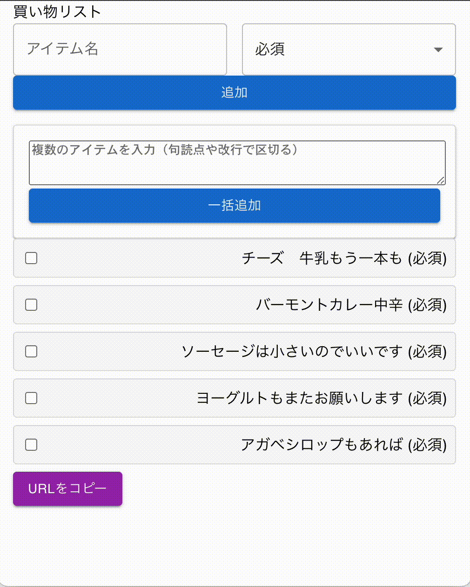
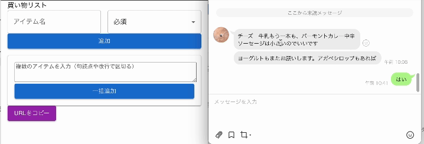

# Simple HeneyDo list

https://rsogo.github.io/simple-honey-do-list/

## 使い方
### 頼みたいものの追加と、リストの共有
頼みたいものを追加して、URLをコピーして相手に送ることで、相手にリストを共有できます。
リストはサーバー側に保存していないので、ログインは不要で使えます。
リストを共有した後に、頼みたいものを追加した場合は再度URLを送ってください。

### テキストからまとめて登録
テキストでリストをもらったときには一括登録することもできます。

